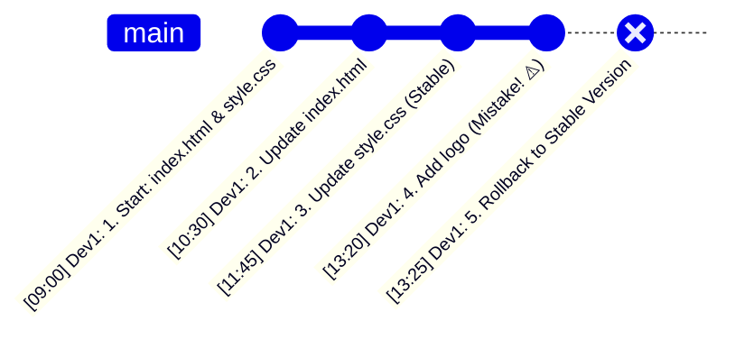
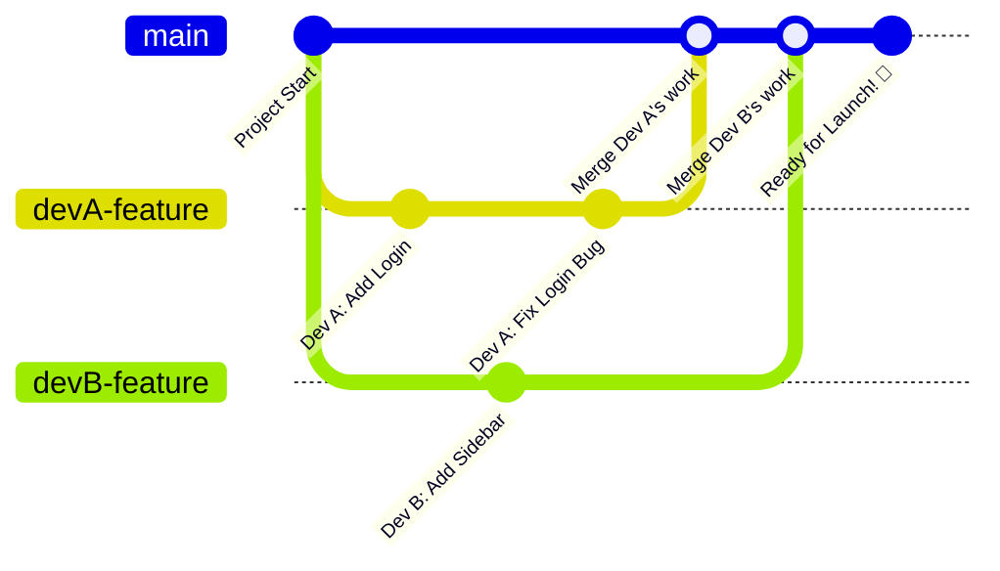
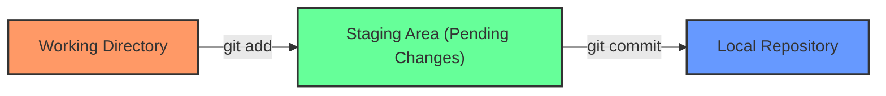
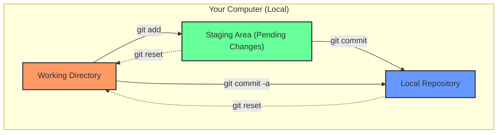
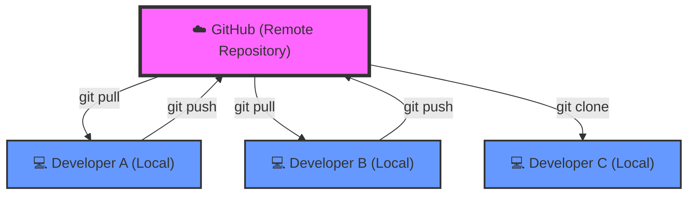

# Introduction to Git and GitHub

## Table of Contents
1. [Overview of Version Control Systems (VCS)](#overview-of-version-control-systems-vcs)
2. [What is Git?](#what-is-git)
3. [Why is Git Important?](#why-is-git-important)
4. [Install & Setup](#4-install--setup-)
5. [Git Commands](#5-git-commands-)
6. [Git Workflow](#6-git-workflow-)
7. [Best Practices & Scenario](#7-hands-on-scenario)
8. [.gitignore](#8-gitignore--
9. [GitHub](#9-github-)

---

## Overview of Version Control Systems (VCS)
- **What is it?** A system that tracks every change you make to your code.
- **The "Time Machine" :** If you make a mistake, you can jump back to a previous version when things were working perfectly.
- **The "Safety Net" :** Never worry about losing your work or accidentally deleting important files.
- **Industry Standard:** **Git** is the #1 tool used by developers worldwide.




### Imagine you’re a programmer working on a project folder.

Every day, you create new files, update old ones, and fix bugs. But without a system, you might ask yourself:
- "What if I make a mistake and can't go back?"
- "Who changed this line of code yesterday?"
- "How do I find out where this bug started?"

**This is where Version Control Systems (VCS) come to the rescue.**
VCS tools like **Git** act like a "Save Game" feature for your project:

Imagine `Dev1` is working on two files. They make a mistake in the third update and need to go back to the previous version.

VCS also allows multiple people to work on the same project without interfering with each other's work by using **branches**.




**Think of it like this:**
1.  **Main Road (main):** The stable version of the project that everyone sees.
2.  **Side Roads (branches):** `Dev A` and `Dev B` each take a "copy" of the project to their own private workspace (branch).
3.  **Parallel Work:** `Dev A` builds a Login feature, while `Dev B` builds a Sidebar at the same time. They don't mess up each other's code!
4.  **Combining (Merge):** Once their work is tested and finished, they "merge" their side roads back into the main road.

---

## What is Git?
Git is a powerful **open-source Version Control System (VCS)** that manages your project's development. Think of it as a super-powered **"Save" system** for your work.

- **📦 Store:** It keeps your source code and its entire history in a **repository** (or "repo").
    - **Repository:** A folder containing all your files and a history of changes.
- **🔍 Track:** It watches every single change you make to your files. No change is too small!
- **⚖️ Compare:** You can easily see the difference between your current work and a version from last week.
- **⏮️ Restore:** If you make a mistake or a bug appears, you can jump back to any previous working version instantly.
- **🤝 Collaborate:** Multiple developers can work on the same project at once, combining their work smoothly without overwriting each other.

### ⌨️ How do we use Git? (CLI vs. GUI)
There are two main ways to talk to Git:

1.  **Git CLI (Command Line Interface):** Typing commands directly into your terminal.
    - **Pros:** Fast, powerful, works on every computer, and shows you *exactly* what Git is doing.
    - **Our Focus:** In this session, we will focus on the **CLI**. Learning Git this way gives you a much deeper understanding of how the system works.
2.  **Git GUI (Graphical User Interface):** Visual tools like GitHub Desktop, VS Code’s Git panel, or GitKraken.
    - **Pros:** Friendly interface, clickable buttons, and easier to see complex file changes visually.

> **💡 Why the CLI?** If you master the command line, you can use *any* GUI tool effortlessly later. It's the "pro" way to learn!

---

## Why is Git Important?
Git is the industry standard for a reason. Here’s why it’s essential for modern coding:

### 1. 🌍 Distributed Version Control
Unlike older systems, Git is **distributed**. This means every developer has a **full copy** of the project history on their own computer.
- **Work Offline:** You can commit changes and view history without an internet connection.
- **Built-in Backup:** Every team member's computer acts as a full backup. If the main server crashes, the project is safe!
- **Speed:** Since you have the data locally, most operations are lightning-fast.

### 2. 🤝 Easy Collaboration
Multiple developers can work on the same project simultaneously. Git handles the "merging" of different people's work, ensuring that no one's code is accidentally overwritten.

### 3. 🔍 Complete History & Tracking
Git keeps a detailed log of **who** changed **what**, **when**, and **why**. This makes it easy to audit code and understand how a project evolved over time.

### 4. ⏮️ Safety Net (Rollback)
Mistakes are part of coding. With Git, you can "undo" any change and roll back to a previous working version in seconds.

### 5. 🌿 Branching & Merging
You can create a "branch" (a separate workspace) to test a new feature or fix a bug without affecting the main project. Once it's perfect, you merge it back in.
*(We’ll explore this in detail later!)*

### 6. 🚀 High Performance
Git is designed to handle everything from small hobby projects to massive codebases (like the Linux Kernel) with incredible speed and efficiency.

---

## 4. Install & Setup 🛠️
To start using Git, you first need to install it on your computer and perform a one-time setup to introduce yourself to the system.

### 📥 1. Download & Install
Go to the official Git website to download the version for your operating system:
- **Windows:** Download from [git-scm.com](https://git-scm.com/download/win). (During installation, you can keep the default settings).
- **macOS:** Download from [git-scm.com](https://git-scm.com/download/mac) or install via Homebrew: `brew install git`.
- **Linux:** Use your package manager (e.g., `sudo apt install git` for Ubuntu).

### ⚙️ 2. First-Time Setup (Identity)
Git needs to know who you are so that every "Save" (Commit) is linked to your name and email. Open your terminal (or Git Bash on Windows) and type:

```bash
# Set your name
git config --global user.name "Your Name"

# Set your email
git config --global user.email "your.email@example.com"

# Set 'main' as the default branch name for new projects
git config --global init.defaultbranch main
```
> **Note:** Use the same email you plan to use for GitHub!

### 🔍 3. Viewing Your Settings
You can always check your current configuration to see what Git knows about you.

```bash
# List all settings (from all levels)
git config --list

# List only global settings (most common)
git config --list --global

# List settings for a specific repository (must be inside a repo)
git config --list --local

# List system-wide settings (for all users on the computer)
git config --list --system
```

### ✅ 4. Verify Installation
To make sure everything is working correctly, type this command:
```bash
git --version
```
If you see something like `git version 2.x.x`, you are ready to go! 🚀

---

## 5. Git Commands 📜
Now that Git is installed and configured, let's learn the essential commands you'll use every day. Think of these as the "tools in your belt" for managing your code.

### 🚀 Starting a Project
Before you can track changes, you need to tell Git which folder it should watch.

*   **`git init`**: Initializes a new, empty Git repository in your current folder.
    - *What happens:* Git creates a hidden `.git` folder to store all history.
*   **`git clone <url>`**: Copies an existing repository from a remote source (like GitHub) to your computer.
    - *Use case:* When you want to work on a project that already exists.

### 🛠️ The Staging Workflow (The "Save" Process)
In Git, saving your work is a two-step process: **Staging** and **Committing**.

#### 1. Check the Status
*   **`git status`**: Shows the current state of your project.
    - 🔴 **Red:** Files that have been changed but aren't "staged" yet.
    - 🟢 **Green:** Files that are ready to be "committed".

#### 2. Stage Your Changes (The "Loading Area")
*   **`git add <file>`**: Adds a specific file to the staging area.
*   **`git add .`**: Adds **all** changed files in the current folder to the staging area.
    - *Analogy:* Like putting items in a box before taping it shut.

#### 3. Commit Your Changes (The "Permanent Save")
*   **`git commit -m "Your message"`**: Saves a snapshot of your staged changes with a descriptive message.
    - *Tip:* Always write clear messages (e.g., "Add login button" instead of "Fix").

### 🔍 Inspecting History
*   **`git log`**: Shows a chronological list of all commits made in the repository.
    - *Shows:* Who made the change, when, and the commit message.
*   **`git log --oneline`**: A simplified, compact version of the history.
*   **`git diff`**: Shows exactly what lines were added or removed in your files since the last save.

### 🌐 Collaboration (Remote Commands)
Once you've saved your changes locally, you might want to share them. (We'll cover GitHub and Remote Repositories in a later section!)

### ⏮️ Undoing & Discarding Changes
We all make mistakes! Git provides several ways to "undo" or go back in time.

*   **`git restore <file>`**: Discards any changes you've made to a file since your last commit.
    - *Use case:* You've messed up a file and want to start over from the last saved version.
*   **`git checkout <commit-id>`**: Temporarily switches your project to an older version (commit).
    - *Note:* Be careful! This is like "visiting" the past.
*   **`git commit --amend`**: Lets you change the message of your last commit or add forgotten files to it.

## 6. Git Workflow 🔄
To use Git effectively, it's important to understand **where** your files are and **how** they move through the different stages of the Git lifecycle.

### 🏗️ The Three "Trees" (States)
Git thinks about your files in three main areas:

1.  **Working Directory:** The folder on your computer where you are currently editing files. (The "Now")
2.  **Staging Area (Index):** A middle ground where you prepare and organize changes before saving them. (The "Box")
3.  **Local Repository (.git):** Where Git stores the permanent snapshots (commits) of your project. (The "Vault")



---

### 📈 The Data Flow (Visualized)
Now that you know the three local areas, let's see how your code moves between them:



*   **`git add`**: Moves your changes from the **Working Directory** to the **Staging Area**.
    - *Think of it as:* Taking a photo of your work and putting it in a "ready to mail" envelope.
*   **`git commit`**: Takes everything in the **Staging Area** and saves it permanently in the **Local Repository**.
    - *Think of it as:* Mailing the envelope. It’s now part of the project's permanent history.
*   **`git commit -a`**: A shortcut that **Adds** and **Commits** all modified files in one go.
    - *Warning:* This only works for files Git already knows about (tracked files). It won't pick up brand-new files!
*   **`git reset <file>`**: The "Unstage" command. It moves a file back from the **Staging Area** to your **Working Directory**.
    - *Use case:* You added a file by mistake and don't want to include it in the next commit.
*   **`git reset <commit>`**: A more powerful "Undo". It moves the state of your **Local Repository** back to a previous commit, and puts those changes back into your **Working Directory**.
    - *Use case:* You want to completely redo your last few saves.

---

## 7. Hands-on Scenario

Let's put everything we've learned into practice with a step-by-step scenario.

### Step 1: Create a Folder & Initialize Git
Open your terminal and create a new project.
```bash
# Create a new folder
mkdir my-first-project
# Change directory or move from the current folder to the project workspace
cd my-first-project

# Tell Git to start watching this folder
git init
```

> **Note:** When you perform `git init`, it creates a hidden `.git` folder inside your project. This folder stores all the history and settings for your repository. 
> 
> If you can't see it, it's because it's hidden by your operating system. You can make it visible by changing your folder view settings (e.g., "Show hidden files" in Windows Explorer or Mac Finder).
>
> ⚠️ **Warning:** If you delete the `.git` folder, you delete your project's entire history! The folder will become a "regular" folder again, and all your "Save Games" (commits) will be gone forever.

### Step 2: Create Your First Files
Let's create two simple files.
```bash
# Create index.html and style.css or simple text files using operating system UI or commands
echo Hello Git > index.html
echo body { color: blue; } > style.css
```

### Step 3: Stage and Commit
```bash
# Check the status (they should be red)
git status

# Add both files to the "Box" (Staging Area)
git add .

# Save them permanently
git commit -m "Initial commit: Add index and style files"
```

**What happened when you committed?**
Git just took everything in the "Box" (Staging Area) and moved it to the "Vault" (Local Repository).
*   **A Snapshot is Created:** Git saved exactly how your files look at this moment.
*   **A Unique ID is Assigned:** Every commit gets a unique "Hash" ID (like a barcode).
*   **The History is Updated:** Git recorded **Who** (you), **When** (now), and **Why** (your message).

### Step 4: Update and Commit Again (The Workflow)
Now, let's change `index.html`.
```bash
# Modify index.html
echo Hello Git - Updated! > index.html

# See the difference
git diff index.html

# Stage and Commit the update
git add index.html
git commit -m "Update: Change heading text in index.html"
```

### Step 5: The "Oops" Moment (Using Restore)
Imagine you accidentally mess up your `style.css`.
```bash
# Accidentally overwrite style.css with garbage
echo THIS IS A MISTAKE > style.css

# Check the status
git status

# 🆘 Oh no! Let's get the old version back from the last commit
git restore style.css

# Check style.css - it's back to normal!
# To read the file content in command line
type style.css
# To read the file content in powershell
cat style.css
```

### Step 6: Fixing a Mistake in the Staging Area
What if you accidentally added a "bad" file to the Staging Area (the Box) but haven't committed it yet?
```bash
# Add some "garbage" to style.css and stage it
echo "body { color: PINK; }" >> style.css
git add style.css

# Check the status - notice it's green (staged)
git status

# 🆘 Let's unstage it (remove it from the "Box")
git restore --staged style.css

# Now it's back to being red (unstaged)
git status

# Optional: Discard the changes completely
git restore style.css
```

### Step 7: Review Your Progress & Understanding Logs
Now that we've made some changes, let's see how Git records them.
```bash
# See your project's history in a compact format
git log --oneline
```
When you run the command above, you'll see something like:
`f1a2b3c (HEAD -> main) Update: Change heading text in index.html`

*   **`f1a2b3c` (The Hash Code):** This is a unique "ID" for your commit. It's like a barcode for that specific version of your project.
*   **`HEAD` (The Pointer):** This tells you where you are right now. Think of it as the "You are here" marker on a map.
*   **`main` (The Branch):** This is the name of the main "timeline" you are working on.

### Step 8: Traveling Back in Time (Reverting to a Hash)
What if you want to go back to a previous version of your project using its ID?

```bash
# To "visit" a previous version (Read-only mode):
git checkout <commit-hash-id>
```
**What happens when you checkout a hash?**
*   **Time Travel:** Your files in the folder will instantly change to look exactly like they did at that moment in the past.
*   **Detached HEAD:** You are now in a "Read-Only" state. You can look at the code and test it, but you aren't on any branch.
*   **Safety:** You haven't deleted anything! Your recent work is still safe on the `main` branch.
*   **How to get back?** Simply type `git checkout main` to return to the present day.


**What if you want to stay in the past and continue working?**
If you want to completely move your history back and then push those changes to GitHub, there are two ways:

#### Option A: The "Time Eraser" Way (Permanent Reset)
Use this if you want to pretend the "mistake" never happened and overwrite your local history.
```bash
# 1. Move your project back to the old hash permanently
git reset --hard <commit-hash-id>
```

> ⚠️ **Warning:** `git reset --hard` will delete all commits and changes that happened after that ID!

```bash
# 2. See the logs - the "future" commits are gone!
git log --oneline

# 3. Continue working from this restored state
echo Hello Git - Recovered Version > index.html
git add index.html
git commit -m "Recovered: Fresh start from a stable version"
```
#### Option B: The "Restore & Move Forward" Way (Safer)
Use this if you want to bring back the "old" files but keep your history moving forward. This is much safer!
```bash
# 1. See the logs
git log --oneline

# 2. Bring the files back from a specific commit
git restore --source=<commit-hash-id> .
# 3. Check the status - everything is back to normal!
git status

# 4. Save this "restored" version as a new commit
git add .
git commit -m "Restore project to version <hash-id>"

# 5. Check the logs - you'll see your old history AND the new "Restore" commit
git log --oneline
```

**Congratulations!** You've just managed a real project using Git like a pro! 🎓

---

## 8. .gitignore 🚫 

### Step 9: Using .gitignore
In every project, there are files that you **don't** want Git to track. This is where the `.gitignore` file comes in.

### ❓ What is it?
A `.gitignore` file is a simple text file where you tell Git which files or folders it should **ignore**.

### 🛠️ Why use it?
1.  **Keep it Clean:** You don't want to track temporary files, log files, or auto-generated folders (like `node_modules`).
2.  **Security:** You should **never** track sensitive information like passwords, API keys, or `.env` files.
3.  **Performance:** Tracking large binary files (like images or videos) can slow down your repository.

### 📝 Common Examples
Here are some things developers usually ignore:
```text
# Node.js dependencies
node_modules/

# Environment variables (Sensitive!)
.env
secrets.json

# Operating System files
.DS_Store
Thumbs.db

# Build folders
dist/
build/
```

### 🚀 Hands-on: Step 9: Using .gitignore
Let's add a `.gitignore` to our `my-first-project` folder.

```bash
# 1. Create a secret file (that we DON'T want to track)
echo PASSWORD=12345 > .env

# 2. Check status - Git sees the new file
git status

# 3. Create the .gitignore file and tell it to ignore .env
echo .env > .gitignore

# 4. Check status again - .env is GONE! Git is now ignoring it.
git status

# 5. Only the .gitignore file itself is visible now
git add .gitignore
git commit -m "Add .gitignore to keep our secrets safe"


# 6. Try to add a file that is in the .gitignore
git add .env
```
If you manually try to add a file that is in your `.gitignore`, Git will refuse to do it and say:
`The following paths are ignored by one of your .gitignore files... Use -f if you really want to add them.`

---

## 9. GitHub 🐙

### ❓ What is GitHub?
GitHub is a powerful **hosting platform** for your Git repositories.
*   **Hosting Service:** A location where all your version control files and project history are stored online.
*   **Collaboration:** A platform for teams to work together on the same project smoothly.
*   **Public & Private:** Offers both private (only you see it) and public repositories (everyone sees it) for free.
*   **Developer Portfolio:** A place to host and showcase your code to the world.

### 🌟 Why Use GitHub?
GitHub is more than just a storage site; it's the heart of modern development.

1.  **📍 Centralized Hosting & Backup**
    *   It provides a single, reliable location to host your Git repositories.
    *   Ensures that all team members can access the same codebase from anywhere.
    *   Acts as a **reliable backup** for your project files and entire history.

2.  **🤝 Seamless Collaboration**
    *   Enables real-time collaboration among developers working on the same project.
    *   Developers work on their own local repositories and simply **push** or **pull** updates to/from the shared remote repository.

3.  **🔗 Integrated Version Control**
    *   GitHub integrates perfectly with Git. It tracks every change, providing a crystal-clear history of who modified what.
    *   Enables you to revert to earlier versions easily, ensuring no work is ever lost.

4.  **🎨 Showcase & Portfolio**
    *   Public projects allow you to showcase your skills to potential employers, clients, or collaborators.
    *   It's an excellent platform to share and contribute to **open-source** projects, making you visible in the developer community.
    *   **Your Portfolio:** Think of GitHub as your professional "reference point" that introduces your coding skills to the world.

### 🌐 The Hub-and-Spoke Model (Visualized)
Here is how GitHub acts as the central heart for your project:



### 🏗️ Key GitHub Concepts
*   **Remote Repository:** The version of your project that lives on GitHub's servers.
*   **Clone:** Downloading an existing GitHub project to your computer.
*   **Pull Request (PR):** A way to propose changes and ask others to review your code.
*   **Issue:** A way to track bugs, tasks, or feature requests.

### 🚀 Connecting Local to Remote (Hands-on Step 10)
Let's connect your `my-first-project` to GitHub!

#### 1. Create a Repository on GitHub
1.  Go to [GitHub.com](https://github.com) and click the **"+"** icon → **"New repository"**.
2.  Give it a name (e.g., `my-first-project`).
3.  Keep it "Public" and click **"Create repository"**.

#### 2. Link Your Local Folder to GitHub
GitHub will give you a URL (e.g., `https://github.com/your-username/my-first-project.git`). Use it in your terminal:
```bash
# Add the remote address (we call it "origin" by default)
git remote add origin https://github.com/your-username/my-first-project.git

# Verify the connection
git remote -v
```

> **What is `origin`?** 
> It's just a **nickname** for your GitHub repository URL. Instead of typing the long link every time, you just say `origin`. You can call it anything, but `origin` is the industry standard.

#### 3. Upload Your Code (Push)
The very first time you push to a new repo, you use the `-u` flag to "set the upstream":
```bash
# Upload your local 'main' branch to the remote 'origin'
git push -u origin main
```

> **What is `-u`?** 
> It stands for **"set-upstream"**. 
> *   **It Creates a Link:** It tells Git that your local `main` branch is now "linked" to the `main` branch on GitHub (`origin`).
> *   **Future Benefit:** Once you do this once, you can just type `git push` or `git pull` from then on, and Git will automatically know where to go!

#### 4. Daily Syncing
Once connected, you'll use these commands every day:
*   **`git push`**: To upload your new commits to GitHub.
*   **`git pull`**: To download **and** merge your teammates' changes into your folder immediately.
*   **`git fetch`**: To "check for updates" on GitHub without changing your own files.
    - *Analogy:* Like checking your mailbox for new mail, but not opening the letters yet.

---


